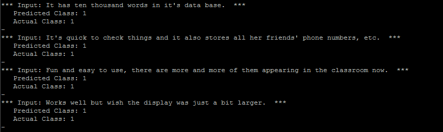

# keras-text-classification

*Work-in-Progress*

The purpose of this project is to explore different text classification models based on Keras Functional API

## Data
- For cnn text classification model: Sentiment Review Dataset
  - toy data is added on "data/sentiment/"
  - if you need the raw data visit: http://jmcauley.ucsd.edu/data/amazon/links.html

## Models
- Convolutional Neural Networks for Sentence Classification (Done)
- Recurrent Neural Netowrks for Sentence Classification (*Work-in-Progress*)
- Seq2Seq with Attention Model for Sentence Classification (*Work-in-Progress*)
- Transformer for Sentence Classification (*Work-in-Progress*)

## Usage
~~~
# Convolutional Neural Networks for Sentence Classification: Solve Sentiment Classification Problem
# Slightly different from Yoon Kim model, batch normalization and multi class classification is supported
python -m bin.conv_model_train
python -m bin.conv_model_eval
~~~



## Paper References
- [Convolutional Neural Networks for Sentence Classification](https://arxiv.org/abs/1408.5882) (EMNLP 2014)

## For Citation
```
@misc{jonghkim,
  author = {Jongho Kim},
  title = {keras-text-classification},
  year = {2018},
  publisher = {GitHub},
  journal = {GitHub repository},
  howpublished = {\url{https://github.com/jonghkim/keras-text-classification}},
}
```